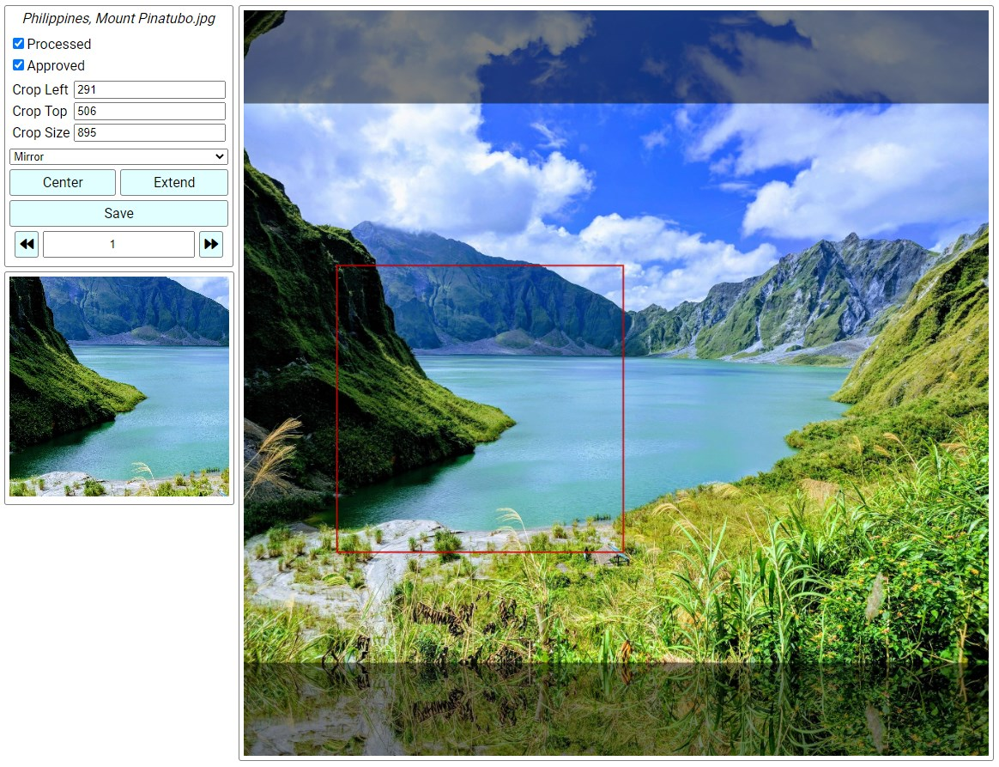
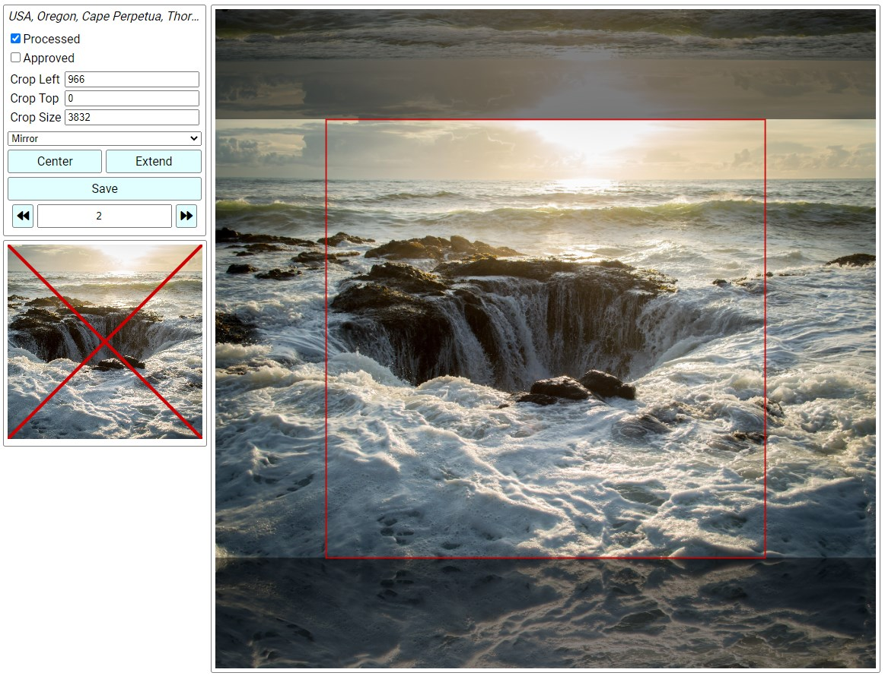
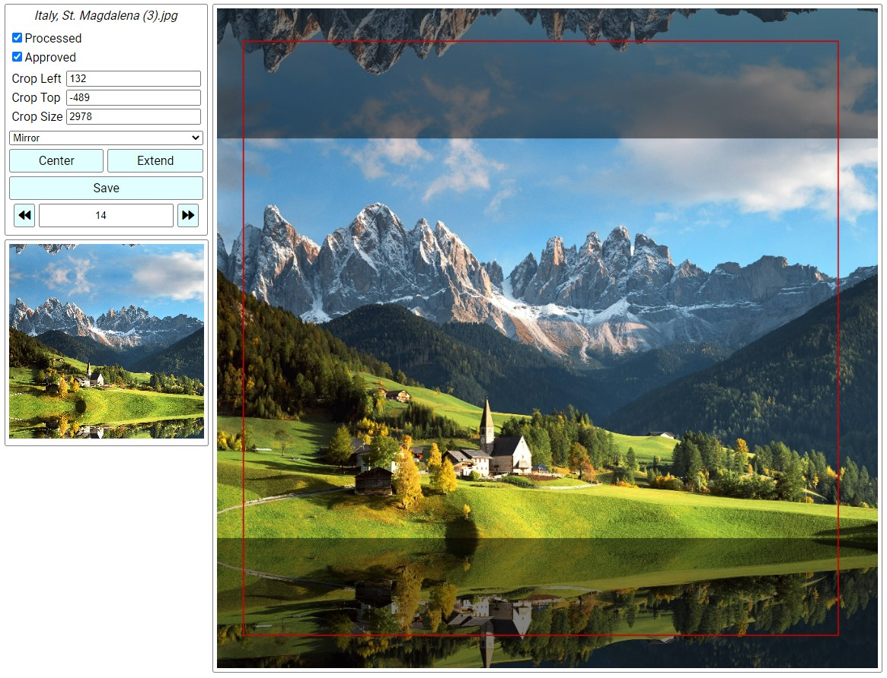
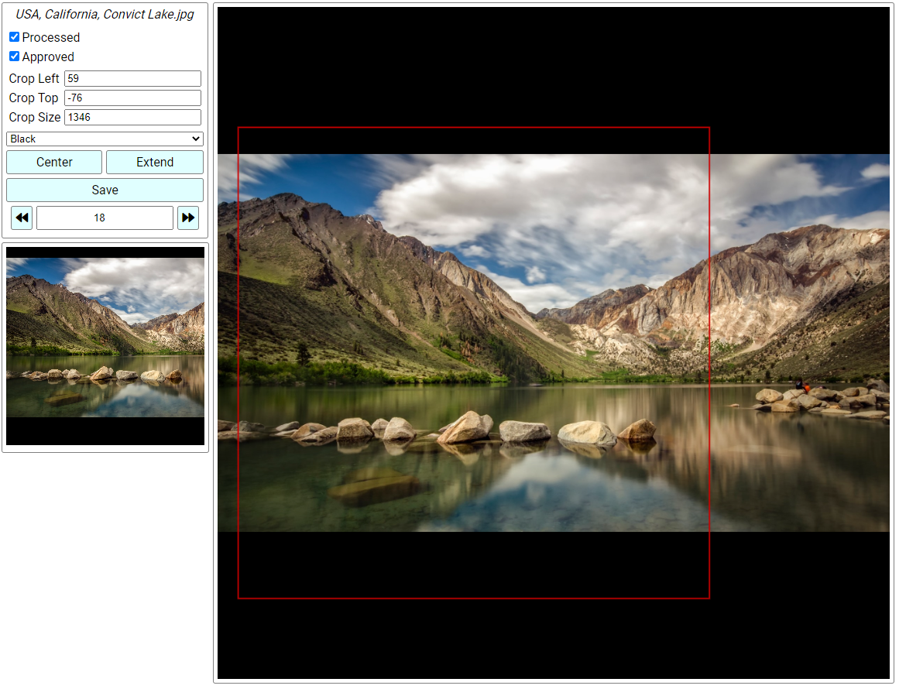

# Image Curator
Image Curator is a web app designed to quickly sort and edit image datasets. I created it after being frustrated with curating a large dataset for training a GAN. Just with my limited testing, I have been able to process 300+ images per hour, including setting custom crop regions for every image.

## Features
- Approve/reject images
- Set crop region
- Set mode to fill in empty space in non-square images
- Preview cropped region
- Everything can be controlled with hotkeys, no mouse needed

## Screenshots

## Setup & Use
1. Run `python web_server.py --imgdir <directory to your images> --dbpath <path to JSON file to use as a database>` 
2. Edit `apiUrl` in `ImageCurator.elm` to match the URL that `web_server.py` is running on
3. Compile the app with `elm make ./src/ImageCurator.elm --output app.js`
4. Host `index.html`, `app.js`, `dist/`, `css/`, and `img/` on a web server. I am just hosting mine locally with an extension for VS Code.
5. Navigate to the hosted site and start curating your images!
6. Everything is saved to the JSON database file. Tool to use this data to output a final dataset coming soon.

## Hotkeys
Hotkeys are a major feature of Image Curator. They allow you to process images very quickly as you don't have to fiddle with a mouse. The keys I have picked for each function are rather arbitrary, so please adjust them for yourself. All you have to do to change a hotkey is change the strings for the `KeyDown` events in the `update` function (and recompile/reload).

### Default Hotkeys
| Keys |	Function |
| --- | --- |
| Arrows | Move crop region |
| +/- | Grow/shrink crop region |
| A/D | Previous/next image. Also auto-saves changes |
| W/S | Previous/next crop extend mode |
| Space | Toggle processed flag |
| Q | Toggle approved flag |
| E | Set crop region to full square (including extended region) |
| R | Set crop region to center of original image |
| Enter | Save changes |

## Planned Features
- Drag to set crop region
- Python script to generate output dataset
- Navigation buttons to go to first/last images
- Navigation button to skip to first unprocessed image
- Image tagging
- Tag regions on image

## Known Issues
- Stretch extend mode doesn't display correctly in the preview

## Disclaimer
I am still very new to Elm. I wrote this app in a single weekend after only reading the first 4 chapters of "Elm in Action". I only barely know what I'm doing. I am confident that there are parts of this app that are very poorly designed, I just don't have experience yet to know what those parts are. Feel free to file issues or pull requests if you want to critique anything.
